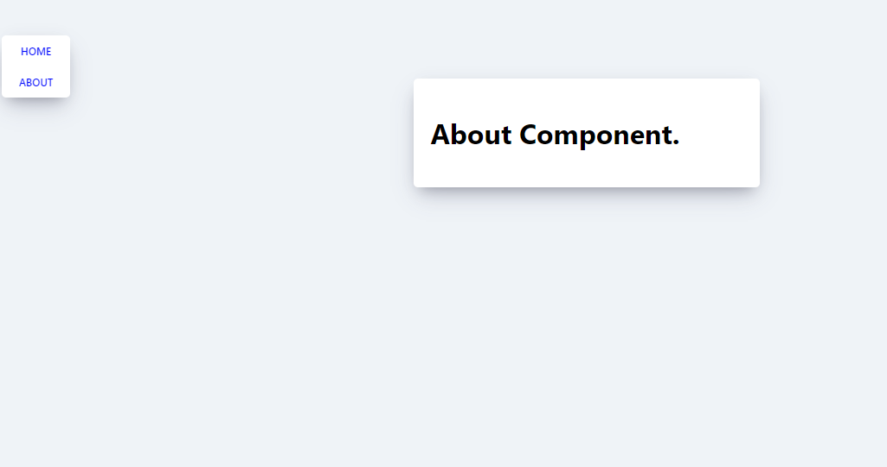
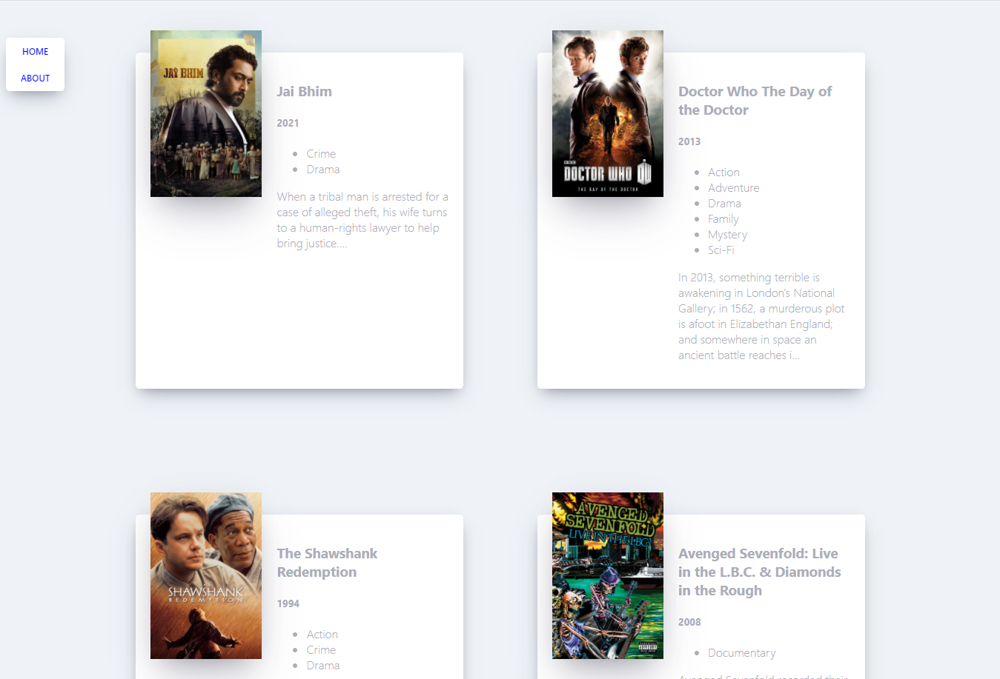
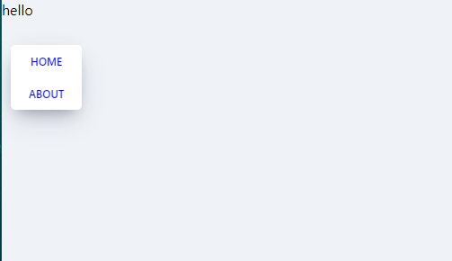

# 김민정 202030302

<details markdown="1">
<summary>1201</summary>
[12월 1일]

>#### 컴포넌트 추출
- 컴포넌트를 여러 개의 작은 컴포넌트를 나누어 관리,  
편의성 및 가독성을 높인다.
- props는 읽기 전용이다.  
  - 함수 컴포넌트나 클래스 컴포넌트 모두 컴포넌트의 자체 props를 수정해서는 안된다.

>#### state and Lifecycle
- clock 컴포넌트를 재사용하고 캡슐화하는 방법
- clock이 스스로 업데이트 되는 것이다.
```
ReactDOM.render(
  <Clock />,
  document.getElementById('root')
);
```
- 이를 위해서는 clock에 state가 있어야 한다.

>#### 클래스에 로컬 state추가하기
- 세 단계에 걸쳐서 date를 props에서 state로 이동한다.
1. render() 메서드 안에 있는 this.props.date를 this.state.date로 변경합니다.
```
class Clock extends React.Component {
  render() {
    return (
      <div>
        <h1>Hello, world!</h1>
        <h2>It is {this.state.date.toLocaleTimeString()}.</h2>
      </div>
    );
  }
}
```
1. 초기 this.state를 지정하는 class constructor를 추가합니다.
```
class Clock extends React.Component {
  constructor(props) {
    super(props);
    this.state = {date: new Date()};
  }

  render() {
    return (
      <div>
        <h1>Hello, world!</h1>
        <h2>It is {this.state.date.toLocaleTimeString()}.</h2>
      </div>
    );
  }
}
```
 - 클래스 컴포넌트는 항상 props로 기본 constructor를 호출해야 합니다.
 3. <Clock /> 요소에서 date prop을 
 삭제합니다.
 ```
 ReactDOM.render(
  <Clock />,
  document.getElementById('root')
);
 ```
 - 결과
 ```
 class Clock extends React.Component {
  constructor(props) {
    super(props);
    this.state = {date: new Date()};
  }

  render() {
    return (
      <div>
        <h1>Hello, world!</h1>
        <h2>It is {this.state.date.toLocaleTimeString()}.</h2>
      </div>
    );
  }
}

ReactDOM.render(
  <Clock />,
  document.getElementById('root')
);
 ```

>#### state를 올바르게 사용하기
- 직접 state를 수정하지 않는다.
- this.state를 지정할 수 있는 유일한 공간은 바로 constructor이다.
- this.props와 this.state가 비동기적으로 업데이트될 수 있기 때문에 다음 state를 계산할 때 해당 값에 의존해서는 안 된다.

>#### 이벤트 처리하기
- React 엘리먼트에서 이벤트를 처리하는 방식은 DOM 엘리먼트에서 이벤트를 처리하는 방식과 매우 유사하다.
- 몇가지의 문법 차이
  - react의 이벤트는 소문자 대신 캐멀 케이스(camelcase)를 사용한다.
  - jsx를 사용하여 문자열이 아닌 함수로 이벤트 핸들러를 전달한댜.
  - react에서는 false를 반환해도 기본 동작을 방지할 수 없으먀, 반드시 preventDefault를 명시적으로 호출해야 한다.
  - js에서는 dom 엘리먼트가 생성된 후 리스너를 추가하기 위해 addEventListener를 호출하지만, react에서는
  엘리먼트가 처음 렌더링될때

</details>

<details markdown="1">
<summary>1124</summary>

[11월 24일]
>#### 외부 플러그인을 사용하는 컴포넌트
- 외부컴포넌트를 사용한 markdown 에디터이다.
- 외부 플러그인은 remarkable을 사용함으로 cdn으로 링크를 추가한다.
- remarkable.js로 검색해야 찾을 수 있다.
- cdn사이트에서 링크를 복사해 추가한다.
- 공식사이트의 소스코드를 복사해 넣는다.
>#### creat-react-app으로, remarkable 사용하기
- creat-react-app으로 markdown-editor 프로젝트를 생성한다.
- 정상 동작을 확인한다.
- App.js에 있는 필요없는 코드를 삭제한다.
- App.js에 문서의 코드를 복사해 넣는다.
- comonent의 이름을 App으로 수정한다.
- rendering은 index.js에 위임한다.
- remarkable을 설치한다.
- react와 remarkable을 import한다.
- 동작이 되는지 확인한다.

>#### code review
- 외부 컴포넌트를 사용하기 위해 생성자 내에 객체를 생성한다.
- state를 이용하여 remarkable에 변환할 마크다운 문장을 제출한다.
- 글리 입력되면 handleChange 이벤트를 사용하여 state의 value를 갱신한다.
- getRawMarkup()메소드를 통해 html을 반환 받는다.

>#### gettingstart
- react는 처음부터 점진적으로 적용할 수 있도록 설계되었으며 필요한
만큼 react를 사용할 수 있다.
- 온라인 코드 편집기를 사용하여 간편하게 리액트를 경험할 수 있다. 
codepen,codesandbox, stackblitz
- codesandbox는 create-react-app으로 생성된 프로젝트와 동일한
환경에서 테스트가 가능핟.
- cdn방식으로 간편하게 테스트를 할 수 있도록 html코드를 제공하고 있다.
- react문서가 어렵게 느껴진다면, tania rascia가 쓴 react 개요를 먼저
학습하는 것이 도움이 된다.
- 개발을 통해 react를 학습하고 싶다면 자습서를 추천

>#### 개념
- 주요 개념
  - 개념을 단계별로 배우려면 주요 개념부터 시작하는 것을 추천

- 고급 개념
  - 강력하지만 일반적으로 많이 사용되지는 않는 react 기능을 소개한다.

- api 참조
  - 특정 react api를 자세히 알아보고 싶을 때 유용한 문서

>#### hook
- 16.8부터 새로 추가된 hook에 대한 자세한 설명을 제공한다.
- 다른 언어를 할 때도 많이 도움이 된다.

>#### CMS
- 홈페이지 관리
- wordpress(매우 많이 쓰는것, 한국에 정착됨, )
- 게시판 중심으로 발달 (dcinside)
- 개발자가아니어도 조금 배우면 홈페이지를 만들 수 있음

>### Main Concepts
1. hello world
```
ReactDOM.render(
  <h1>Hello, world!</h1>,
  document.getElementById('root')
);
```
2. jsx 소개
- jsx표현식을 변수에 저장한걸 변수를 jsx표현식에서 가져가서 사용할 수 있다
- jsx에 표현식 포함하기
```
const name = 'Josh Perez';
const element = <h1>Hello, {name}</h1>;

ReactDOM.render(
  element,
  document.getElementById('root')
);
```
- 함수의 호출 결과를 jsx에 표현식 포함하기
- if,for문 등과 함께 사용, 변수에 할당, 인자로 받고, 함수로부터 반환할 수 있다.
```
function getGreeting(user) {
  if (user) {
    return <h1>Hello, {formatName(user)}!</h1>;
  }
  return <h1>Hello, Stranger.</h1>;
}
```
- 속성에 따옴표를 이용해 문자열 리터럴을 정의할 수 있다.
```
const element = <div tabIndex="0"></div>;
```
- 속성에 중괄호를 사용하여 javascript 표현식을 삽입할 수 있다
```
const element = </img>;
```
- babel은 jsx를 react.createElement()호출로 컴파일 한다.

>#### Components와 Props
-react에는 함수 컴포넌트와 클래스 컴포넌트가 있다. 
- 컴포넌트의 이름은 항상 대문자로 시작한다.
- 문서 '컴포넌트 렌더링'예제의 실행 과정은 다음과 같다.
```
1.<Welcome name="Sara" /> 엘리먼트로 ReactDOM.render()를 호출합니다.
2.React는 {name: 'Sara'}를 props로 하여 Welcome 컴포넌트를 호출합니다.
3.Welcome 컴포넌트는 결과적으로 <h1>Hello, Sara</h1> 엘리먼트를 반환합니다.
4.React DOM은 <h1>Hello, Sara</h1> 엘리먼트와 일치하도록 DOM을 효율적으로 업데이트합니다.
```
</details>
<details markdown="1">
<summary>1117</summary>

[11월 17일]
>#### package.json homepage
- "homepage":"https://s9one1.github.io/movie_app_2021"로 하는 방식에서  
"homepage" : "c://DeveloperN/movie21/"으로 바꿔 검생하는 방식
>#### state가 포함된 component
- 동적인 데이터는 this.state로 접근할 수 있다.

>#### todo List
- todoapp과 todolist 두개의 컴포넌트로 구성
- handlechange는 모든 키보드 입력마다 react의 state를 갱신해서 보여준다.
- element에서 확인한다.
- 시간순으로 보면 유저입력>handlechange>react의 state갱신>from element가 react state를 참조
- 유저 입력을 강제로 대문자로 변경할 경우에도 사용한다.
```
handleChange(event) {
    this.setState((value:event target value toUpperCase()))
}
```
- handlesubmit은 버튼이 클릭될때 발생하는 event를 처리한다.

>#### render() 메소드
- render() 메소드에서 초기 렌더링을 실행한다.
- onChange를 통해 input에 입력되는 값으로 state상태 변경을 준비한다.
- 입력된 값은 state의 "text"에 임시로 저장된다.
- level의 htmlFor은 input 과의 연결을 위한 id 값이다.
    - className 처럼 html 과 구분하기 위해 jsx에서 사용하는 키워드이다.

>#### todo.html
```
<!DOCTYPE html>
<html lang="en">
<head>
    <meta charset="UTF-8">
    <meta http-equiv="X-UA-Compatible" content="IE=edge">
    <meta name="viewport" content="width=device-width, initial-scale=1.0">
    <title>todo</title>
    <script crossorigin src="https://unpkg.com/react@17/umd/react.production.min.js"></script>
    <script crossorigin src="https://unpkg.com/react-dom@17/umd/react-dom.production.min.js"></script>
    <script crossorigin src=""></script>
    <script src="https://unpkg.com/babel-standalone@6/babel.min.js"></script>
    <script type="text/babel">
        class TodoApp extends React.Component {
  constructor(props) {
    super(props);
    this.state = { items: [], text: '' };
    this.handleChange = this.handleChange.bind(this);
    this.handleSubmit = this.handleSubmit.bind(this);
  }

  render() {
    return (
      <div>
        <h3>TODO</h3>
        <TodoList items={this.state.items} />
        <form onSubmit={this.handleSubmit}>
          <label htmlFor="new-todo">
            What needs to be done?
          </label>
          <input
            id="new-todo"
            onChange={this.handleChange}
            value={this.state.text}
          />
          <button>
            Add #{this.state.items.length + 1}
          </button>
        </form>
      </div>
    );
  }

  handleChange(e) {
    this.setState({ text: e.target.value });
  }

  handleSubmit(e) {
    e.preventDefault();
    if (this.state.text.length === 0) {
      return;
    }
    const newItem = {
      text: this.state.text,
      id: Date.now()
    };
    this.setState(state => ({
      items: state.items.concat(newItem),
      text: ''
    }));
  }
}

class TodoList extends React.Component {
  render() {
    return (
      <ul>
        {this.props.items.map(item => (
          <li key={item.id}>{item.text}</li>
        ))}
      </ul>
    );
  }
}

ReactDOM.render(
  <TodoApp />,
  document.getElementById('todos-example')
);
    </script>
</head>
<body>
    <div id="todos-example"></div>
    
</body>
</html>
```
>#### handleSubmit(e)에서 e.preventDefault() 메소드를 사용하는 이유
- 브라우저에서 양식을 제출할 때는 기본적으로 부라우저의 새로고침이 발생한다.
    - react나 spa(single page application)의 경우 필요가 없는 동작임으로 이를 방지하기 위해 사용한다.
1. state.text의 길이가 0이면 아무것도 반환하지 않는다.
2. 0이 아니면 newite에 입력받은 text와 현재 시간을 저장한다.
3. 저장된 newitem을 state의 item 배열에 저장하고, text를 비운다.

>#### key props의 역할
- key는 props의 안정적으로 사용할 수 있도록 고유성을 부여하기 위해 필오하다.
- react가 어떤 props를 변경, 추가 또는 삭제할지 식별하는 것을 도와준다.
- 반드시 date를 사용하지 않아도 되며, 배열의 index값을 사용해도 된다.
- 유일한 값이라면 그 값이 무엇이든 상관없다.

>#### 외부 플러그인을 사용하는 컴포넌트
- 외부컴포넌트를 사용한 markdown에디터 이다.
- 현재 1~3의 예제를 cnd방법으로 진행했음으로 동일하게 진행한다.

>#### remarkable
- https://github.com/jonschlinkert/remarkable
- https://cdnjs.com/libraries/remarkable
```
<!DOCTYPE html>
<html lang="en">
<head>
    <meta charset="UTF-8">
    <meta http-equiv="X-UA-Compatible" content="IE=edge">
    <meta name="viewport" content="width=device-width, initial-scale=1.0">
    <title>hello</title>
    <script crossorigin src="https://unpkg.com/react@17/umd/react.production.min.js"></script>
    <script crossorigin src="https://unpkg.com/react-dom@17/umd/react-dom.production.min.js"></script>
    <script crossorigin src=""></script>
    <script src="https://unpkg.com/babel-standalone@6/babel.min.js"></script>
    <script src="https://cdnjs.cloudflare.com/ajax/libs/remarkable/2.0.1/remarkable.min.js" integrity="sha512-skYYbQHAuOTpeJTthhUH3flZohep8blA+qjZOY0VqmfXMDiYcWxu29F5UbxU4LxaIpGkRBk+3Qf8qaXfd9jngg==" crossorigin="anonymous" referrerpolicy="no-referrer"></script>
    <script type="text/babel">
        class HelloMessage extends React.Component {
        render() {
            return (
            <div>
                Hello {this.props.name}
            </div>
            );
        }
        }

        ReactDOM.render(
        <HelloMessage name="Taylor" />,
        document.getElementById('hello-example')
        );
    </script>
</head>
<body>
    <div id="hello-example"></div>
    
</body>
</html>
```
- npx create-react-app markdown-ditor를 터미널에서 사용해서 깔기
- npm install remarkable --save를 터미널에서 사용해서 저장
</details>

<details markdown="1">
<summary>1110</summary>

[11월10일]
>#### detail.js
```
render() {
        const { location } = this.props
        if (location.state) {
            return (
                <span>{ location.state.title }</span>
            )    
        } else {
            return null
        }
        
    }
```
>#### localhost:3000/#/에서 #없애기
- #이 있으면 크롤링이 안된다.
    - 만들어 배포했을때 검색이 되지 않는다.
-import { HashRouter, Route} from 'react-router-dom'를  
import { BrowserRouter, Route} from  
   'react-router-dom'로 바꾸면 #이 안뜸
```
import './App.css'
import { BrowserRouter, Route} from 'react-router-dom'
import About from './routes/About'
import Home from './routes/Home'
import Navigation from './components/Navigation'
import Detail from './routes/Detail'
```
>#### git.io
- 깃허브에서 호스팅을 해줌

- 깃허브에서 https 주소를 가져온 다음 (https://github.com/s9one1/movie_app_2021.git) package.json에서 github.io로 바꾼다.
(https://s9one1.github.io/movie_app_2021)
```
  "homepage": "https://s9one1.github.io/movie_app_2021"
```
>#### package.json
- scripts에 predeploy,deploy 추가
```
"scripts": {
    "start": "react-scripts start",
    "build": "react-scripts build",
    "predeploy": "npm run build",
    "deploy": "gh-pages -d build"
  },
```
>#### react 캡슐화된 컴포넌트
- 메인 어플리케이션으로 부터 독립되어있는 컴포넌트를 말한다.
- 컴포넌트 내부에서 발생하는 업데이트, 테스트 케이스, 재사용에 용이하게 컴포넌트를 설계해야한다.
- 내부에 있는게 무엇인지 모르게 한다.
>#### react
- 상호작용이 많은 ui개발에 적합하다.
- 컴포넌트 로직은 javascript로 작성한다.
- 캡슐화된 컴포넌트로 개발되어 재사용이 용이하다.(중요)
- dom과는 별개로 상태를 관리할 수 있다. 
- 기술 스택의 나머지 부분에는 관여하지 않는다.
- 기존 코드와 별개로 개발이 가능하다.
- react native를 이용하면 모바일 앱도 만들 수 있다.
>#### cdn
- https://ko.reactjs.org/docs/cdn-links.html
- access-control-allow-origin: * 허가를 했다. 정상적으로 배포된걸 사용했다.

>#### 바벨
- 커파일러를 상대방의 버전에 맞게 구식으로 바꿔주는것
- jsx바벨이 있어야 해석이 가능에서 링크를 해줘야함
>#### 간단한 컴포넌트
- react component 에서 render()메소드를 사용하는 예제이다.
- render() 메소드는 데이터를 입력받아 화면에 반환하는 역할을 한다.
- 컴포넌트로 전달된 데이터는 render() 안에서 this.props를 통해 접근 가능핟.
- react를 개발하는데 반드시 jsx를 
>#### state가 포함된 component
- 동적인 데이터를 this.state로 접근할 수 있다
- state가 변하면 render()메소드가 다시 호출되어 화면이 갱신된다.
- 예제는 화면이 켜져있는 동안 초를 카운트하는 timer앱이다.
- 초기의state를 0으로 출력한다. 
- 이후 componentdidmount()메소르도 1초에 한번씩 tick()메소드를 호출한다.
- 호출된 tick()메소드는 setstate()를 통해 state를 1씩 증가시킨다.
</details>
<details markdown="1">
<summary>1103</summary>

# [11월 03일]
### 1.ABOUT

### 2.HOME

### 3.영화링크

>#### 링크를 누른 후 http://localhost:3000/#/movie-detail주소를 다시 입력하면 home화면으로 다시 돌아간다.

>#### 컴포넌트 설치 오류
```
npm WARN read-shrinkwrap This version of npm is compatible with lockfileVersion@1, but
package-lock.json was generated for lockfileVersion@2. I'll try to do my best with it!
npm ERR! Maximum call stack size exceeded
npm ERR! A complete log of this run can be found in:
npm ERR! C:\Users\82102\AppData\Roaming\npm-cache\_logs\2021-10-
27T07_07_17_243Z-debug.log
```
>#### 원인 규명이 되지 않은 오류가 있을 경우
 npm cache clean --force  
 npm rebuild  
 rm -rf node_modules  
 npm install  
  
* 만일 rm명령이 실행되지 않으면 shell을 관리자 권한으로 실행한 후 다시 시도해 본다.
* 그래도 안될 경우는 탐색기에서 삭제하면 되는데 시간이 조금 걸릴 수는 있다.
* 원인 모를 문제가 발생했을 때 cache clean과 rebuild를 통해 많은 부분 해결되기도 한다.
>#### package.json과 package-lock.json 차이
- package.json은 패기지 의존성 관리 파일이다.
- 협업을 할 때는 팀원들 각자의 컴퓨터에 같은 패키지들을 설치해서 동일한 개발환경을 구성해야 하는
게 이때 사용하는 것이 package.json이다. 
-  개인의 프로젝트를 재 생성하거나, 오류가 있을 때 유용하게 사용된다.
- 팀원의 버전이 다를 경우
    - 팀원끼리 npm버전이 일치하는지 확인. $ npm –version
    - node_modules 폴더를 전부 삭제
    - npm cache 삭제.
    - node_modules 재설치. $ npm install
- package.json의 경우는 version range를 사용한다. "express": "~4.16.1“
</details>
<details markdown="1">
<summary>1027</summary>

# [10월 27일]
>#### 라우터
- 메뉴를 클릭하면 화면이 이동하게 하는것이 라우터이다.
- 라우터는 react-router-dom패키지를 이용한다.
>npm install react-router-dom
- 라우터는 사용자가 입력한 url을 통해 특정 컴포넌트를 불러준다.(loclahost:3000/about)

>#### HashRouter, Router컴포넌트
- Router에는 2가지 props를 전달할 수 있다.
    - URL을 이용한 path props
    - URL에 맞는 컴포넌트를 불러 주기 위한 component props

>#### About.js 수정하기
- 내용 채우기

>#### Home 컴포넌트를 위한 Route 컴포넌트 추가하기
- localhost:3000에 접속하면 기본으로 보여줄 컴포넌트를 Home 컴포넌트로 하기위해 path props를 "/"로 입력한다.
```
function App() {
  return (
    <HashRouter>
      <Navigation/>
      <Router path = '/' exact={true} component={Home} />
      <Router path='/about' component={About}/>
    </HashRouter>
  )
}
```

>#### Home 링크
- 링크를 클릭할 때마다 리액트가 죽고, 새 페이지가 열리는 문제 발생
    - a 태그의 href속성이 페이지 전체를 다시 그리는 성질을 갖고 있기 때문이다.
    - reac-router-dom의 Link컴포넌트를 사용하면 해결된다.
>#### Navigation 컴포넌트 위치 다시 확인하기
- Link, Router 컴포넌트는 반드시 HashRouter안에 포함되어야 한다.
- HashRouter바깥에 위치한 Nacigation 컴포넌트를 안쪽으로 이동해야한다.

>#### router props
- route props를 이용해 영화 카드를 누르면 상세 정보를 보여주는 기능을 만든다.
- route props는 라우팅 대상이 되는 컴포넌트에 넘겨주는 기본 props를 말한다.
- Route 컴포넌트가 그려줄 컴포넌트에는 항상 이 props가 전달되며, 이 props는 원하는 데이터를 담아 보낼 수 있다.
- 데이터를 담아 보내려면 Navigation 컴포넌트에 있는 Link컴포넌트의 to props의 구조를 바꿔야 한다.
- pathname은 URL을 의미하며, state는 우리가 route props에 보내줄 데이터를 의미한다.

</details>

<details markdown="1">
<summary>1013</summary>

# [10월 13일]
>#### Movie 컴포넌트 만들기
- src폴더에 Movie.js 파일을 새로 만든다.
- 컴포넌트의 기본 골격을 작성한다.
- 함수형 컴포넌트로 작성하기로 한다.
- Movie에 넘어와야 하는 영화 데이터를 정의하고,관리하기 위해 prop-types를 사용한다. 
```
import PropTypes from 'prop-types';

function Movie() {
    return <h1></h1>;
}

Movie.propTypes = {};

export default Movie;
``` 
>#### Movie.propTypes 작성하기
-  id를 Movie.propTypes를 추가 한다. 
    - PropType.number.isRequired로 작성한다.
- year, title, summary, poster를 각각 Movie.propTypes에 추가 한다.
    - poster props는 영화 포스터 이미지 주소를 저장하기 위한 것이다
```
Movie.propTypes = {
    id:PropTypes.number.isRequired,
    year:PropTypes.number.isRequired,
    title:PropTypes.string.isRequired,
    summary:PropTypes.string.isRequired,
    poster:PropTypes.string.isRequired,
};
```
>#### axios.get() 수정하기
- axios.get()에 yts-proxy.now.sh/list_movies.json?sort_by=rating을 전달한다
```
getMovie = async () => {
  const {
    data: {
      data: {movies}
    }
  }=await axios.get('https://yts-proxy.now.sh/list_movies.json?sort_by=rating');
```
>#### Movie 컴포넌트에서 props를 추가하고 출력해보기
- Movie 컴포넌트에서 id, title, year, summary, poster props를 받아 출력할 수 있도록 수정한다.
- map() 함수로 출력
```
function Movie({ year, title, summary, poster }) {
    return <h4>{title}</h4>;
}
```
>####  App 컴포넌트에서 Movie컴포넌트 그리기
- 로딩이 완료 되면 실행되는 자리에 movies.map()을 사용한다.
- map() 함수의 첫 번째 인자로 컴포넌트를 반환하는 함수를 전달하면 된다
```
render(){
      const { isLoading, movies } = this.state;
      return <div>{isLoading ? 'Loading...' : movies.map()}</div>;
}
```
>####  map() 함수에 컴포넌트를 반환하는 함수 전달하기
- console탭에 영화 데이터를 출력한 다음, 아무것도 반환하지 않는 함수를 전달해 본다.

>#### Movie 컴포넌트를 반환하도록 movies.map() 수정하기
- App.js에 Movie 컴포넌트를 import한 다음, movies.map()에 전달한 함수가 <Movie />를 반환하도록 한다.
```
import Movie from './Movie'
```
>#### Movie컴포넌트에 props 전달하기
- props를 모두 전달해야 한다.
- poster props의 경우 키 이름이 medium_cover_image이므로 movies.medium_cover_image라고 작성한다.
```
    id = {movie.id} 
    year = {movie.year}
    title = {movie.title}
    summary = {movie.summary}
    poster = {movie.medium_cover_image}
```
>#### App.css 파일 작성하기
- 배경색을 어두운 색으르 바꾼다.
```
body {
    background-color:#2f2f2f;
}
```
</details>

<details markdown="1">
<summary>1006</summary>

[10월 6일]

>##### axios 설치하기
-  javascript에서는 영화 데이터를 로딩 할 때 fetch()함수를 사용한다. 
```
> npm install axios
```
>##### YTS영화 데이터 API 살펴보기
- 브라우저 주소창에 yts.it/api 라고 입력하고, YTS영화 데이터 API 사이트에 접속
- ListMoviesApi를 사용한다.
- API는 특정 주소를 입력하면 그 주소에 맞는 결과를 보내 준다.
>##### 영화 목록 데이터 확인해 보기
- 브라우저에서 Endpoint의 주소 중 json으로 끝나는 주소를 입력한다.
```
https://yts.mx/api/v2/list_movies.json
```
>##### JSON Viewer 확장 도구 설치하기
- JSON Viewer라는 확장 도구를 설치하면 정상적으로 볼 수 있다.

>##### https://yts.mx/api/v2/list_movies.json
- status: 응답상태 메시지
- data: 영화 데이터
- movie_count: API가 보내준 영화 데이터의 개수
- limit: 보내준 데이터의개수
- movies키의 서브키로 id, url, imdb_code, title 등을 제공한다.

>##### 노마드 코더 영화 API를 사용하자
- YTS의 endpoint /list_movies.json을 사용하려면 yts-proxy.now.sh에 /list_movies.json을 붙이
면 된다.
- 만일 YTS의 다른 endpoint와 함께 노마드 코더 영화 API를 사용하려면,
yts-proxy.now.sh에 endpoint를 붙이면 된다.
```
https://github.com/serranoarevalo/yts-proxy
```

| endpoint | YTS API | 노마드 코더 영화 API |
|:---:|:---:|:---:|
| list_movies | yts.mx/api/v2/list_movies.json | yts-proxy.now.sh/list_movies.json |
| movie_details | yts.mx/api/v2/movies_details.json | yts-proxy.now.sh/movies_details.json |


>##### 영화 정보를 더 자세히 보기 위한 조건 추가
- yts-proxy.now.sh/list_movies.json에 movie_id를
추가

>##### 노마드 코더 영화 API를 영화 앱에서 호출하기
- API를 사용하려면 axios를 import한 다음, componentDidMount()함수에서 axios로 API를 호출
- axios.get()함수의 인자에 URL을 전달하여 API를 호출
- setTimeout은 이제 사용할 필요가 없으니 삭제

>##### getMovies()함수 기다린 다음, axios.get() 함수가 반환한 데잍터 잡기
- getMovies()함수를 만들고, 이 함수 안에서 axios.get()이 실행하도록 한다.
- axios.get()의 return값은 movies에 저장한다.
-  componentDidMount()함수가 실행되면 this.getMovie()가 실행된다.

>##### getMovies() async 붙이고, axios.get()에 await붙이기
- 시간이 필요하다는 것을 알리기 위해서는 async, await 키워드가 필요하다.
-  시간이 필요하다는 것을 알리려면 async를 ()앞에 붙이고, 실제 시간이 필요한 대상인 axios.get()함수 에는 await을 붙인다.

>##### movies state에 영화 데이터 저장하기
- this.setState({ movies: movies })와 같이 작성해서 movies state에 영화 데이터를 저장
- this.setState({ movies: movies })를 this.setState({ movies })로 수정한다.
>##### isLoading state를 true에서 false로 업데이트 하기
- 서 “영화 데이터의 출력”를 출력하려면 isLoading state의 값을 true에서 false로 업데이트한다.
- 앱이 실행되면 처음에는 Loading...이 화면에 나타나다가 조금 시간이 지나면 We are ready로 변한다.
-  movies state를 출력한다.

</details>


<details markdown="1">
<summary>0929</summary>

[09월 29일]

>##### 상대경로 이미지 삽입 방법
- 이미지가 적을 경우 import를 사용한다.
1. public 폴더에 images폴더를 생성한다.
2. 필요한 곳에 형태로 태그를 작성한다.

##### 음식 앱에 prop-types 도입하기

>##### 음식 데이터에 rating 추가하기
- foodLike 배열의 각 요소에 rating을 추가한다.
- 값의 자료형은 number로 한다.
Rating props를 Food 컴포넌트에 전달하면서 값을 검사한다.
- prop-types도구를 사용하여 자료형을 검사한다.
```
명령 프롬포트
> npm install prop-types
```

>##### prop-types 정상 설치 여부 확인
- Package.json 파일을 열어 dependencies 키에 있는 값을 살펴본다.
- Prop-types가 등록되어 있으면 정상 설치 됨.

>##### prop-types 적용하기
- import PropTypes from 'prop-types';를 App.js파일 맨 위에 추가
- ration props를 Food 컴포넌트에 전달한다.

>##### Food.propTypes 작성
- Food.propType에 객체 적어 주기
- 모든 props는 문자열이고 반드시 있어야 한다는 조건 추가
- 콘솔 탭을 확인하면 경고 메세지가 보인다.

>##### Food.propTypes의 rating 키 값 확인하기
- isRequired는 필요하다.
- 'rating에는 string이라는 자료형이 반드시 필요하다'

>##### prop-types 경고 해결하기
- rating: PropTypes.string.isRequired 대신 rating: PropTypes.number.isRequired 로 교체

>##### 다른 종류의 prop-types 경고 해결하기
- picture props의 이름을 image로 바꾸기
- Food 컴포넌트에 picture라는 이름의 props가 필요한데, 그 값이 undefined다.

>##### render() 함수
- render( ) 함수 내에서 return문을 사용한다
- 함수형 컴포넌트는 return문이 JSX를 반환하지만, 클래스형 컴포넌트는 render()함수가 JSX를 반환한
다.
```
import React, {Component} from 'react'

class App extends Component {
    render() {
        return (
            <h1> I am a class component </h1>
        )
    }
}

export default App
```
</details>


<details markdown="1">
<summary>0915</summary>

[09월 15일]

### JSX 
___

- 컴포넌트는 자바스크립트와 html을 조합한 jsx라는 문법을 사용해서 만든다.
- jsx의 문법은 js와html 문법의 조합한 것이다.
>##### Potato 컴포넌트 만들기
- import 구문을 입력해야 리액트가 jsx를 이해할 수 있어 반드시 입력
```
import React from 'react';
```
>##### Potato()함수를 작성한다.
- 컴포넌트를 작성할 때 이름은 대문자로 시작해야 한다.
```
import React from 'react';
function Potato() {

}
```
>##### Potato 컴포넌트가 JSX를 반환하도록 만든다.
```
import React from 'react';

function Potato() {
    return <h3>I love potato</h3>;
}
```
>##### 마지막 줄에 export 구문을 다음과 같이 추가한다.
```
import React from 'react';

function Potato() {
    return <h3>I love potato</h3>;
}
```
>##### Photo 컴포넌트 사용하기
```
import React from 'react';
import ReactDOM from 'react-dom';
import App from './App;

ReactDOM.render(<App /><Potato/>, document.getElementById('root'));
```
</details>
<details markdown="1">
<summary>0908</summary>

[09월 08일]
>#### 수업 준비
1. create-react-app(별다른 개발환경 구축없이 개발을 바로 시작할 수 있도록 프로젝트 구조, 설정 작업 등을 자동으로 진행해 주는 도구)
2. create-react-app으로 리액트 앱 만들기(작업 디렉토리를 미리 만들고 실행하면 편함, 수업에서는 movie_app_2021로 통일, 명령은> npx create-react-app movie_app_2021)
3. 프로젝트 폴더 선택하기
4. README.md 파일 수정하기(매주 학습내용을 작성한다.)
5. package.json 파일 수정하기(test,eject 명령어 삭제하고 파일 저장)
6. 리액트 앱 실행하기(명령 프롬프트에서 npm start로 앱을 실행)
7. 리액트 앱 종료하기(종료하려면 프롬포트에서 Ctrl + c를 누른다.)
8. 깃허브에 리액트 앱 업로드하기
9. 리액트 앱 살펴보고 수정하기
10. index.js파일 수정하기
11. App.js 파일 수정하기
12. index.html 수정해 보기
>#### 리액트 앱
1. 리액트 앱 실행, 터미널 종료하고 브라우저 새로 고침
2. 리액트 앱 다시 실행하고 코드 수정하기
```
import React from 'react';

function App() {
    return (
        <div>
        <h1>Hello!!!!</h1>
        </div>
    );
}

export default App;
```
>#### 리액트 기초 개념 
1. 컴포넌트
- function으로 정의 내린 곳을 컴포넌트라고 한다.
- App()함수가 정의되어 있고, 함수는 html문서를 return해 주고 있는것을 App컴포넌트를 정의했다고 한다.
- index.js 파일로 컴포넌트의 사용 알아보기
2. JSX
- js와 html 문법의 조합한 것으로 사용하다 보면 자연스럽게 익힐 수 있다.
>#### Potato 컴포넌트 만들기
1. src폴더 안에 Potato.js 파일 만들기
2. 첫 글자는 대문자로
3. import 구문을 입력해야 리액트 jsx를 이해할 수 있다.
```
import React from 'react';
```
4. Potato()함수 작성
```
import React from 'react';
function Potato() {

}
```
5. Potato 컴포넌트가 jsx를 반환
```
import React from 'react';
function Potato() {
    return <h3>I love potato</h3>;
}
```
6. 마지막 줄에 export 구문 추가
```
import React from 'react';
function Potato() {
    return <h3>I love potato</h3>;
}

export default Potato;
```
</details>

<details markdown="1">
<summary>0901</summary>
[09월 01일]
>#### 교재는 Do it! 클론 코딩 영화 평점 웹서비스
>#### 클론 코딩
- 실제로 존재하는 사이트나 앱의 코드를 보며 그래도 따라 만들거나 습득하는 학습 방법
- 이론의 양이 많음
- 실습의 완성도가 떨어지고, 실제 프로젝트에서의 활용도가 떨어짐
- 완성된 프로젝트를 클론해서 하나씩 완성해 가는 실습위주의 학습
- 자기주도 학습으로 코딩을 하는데 도움을 줌
>#### 클론 코딩 수업 준비하기
- node.js 설치
- npx 설치
- vscode 설치
- git 설치
</details>